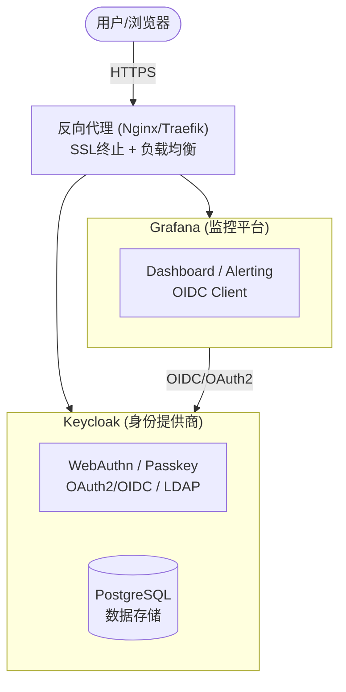
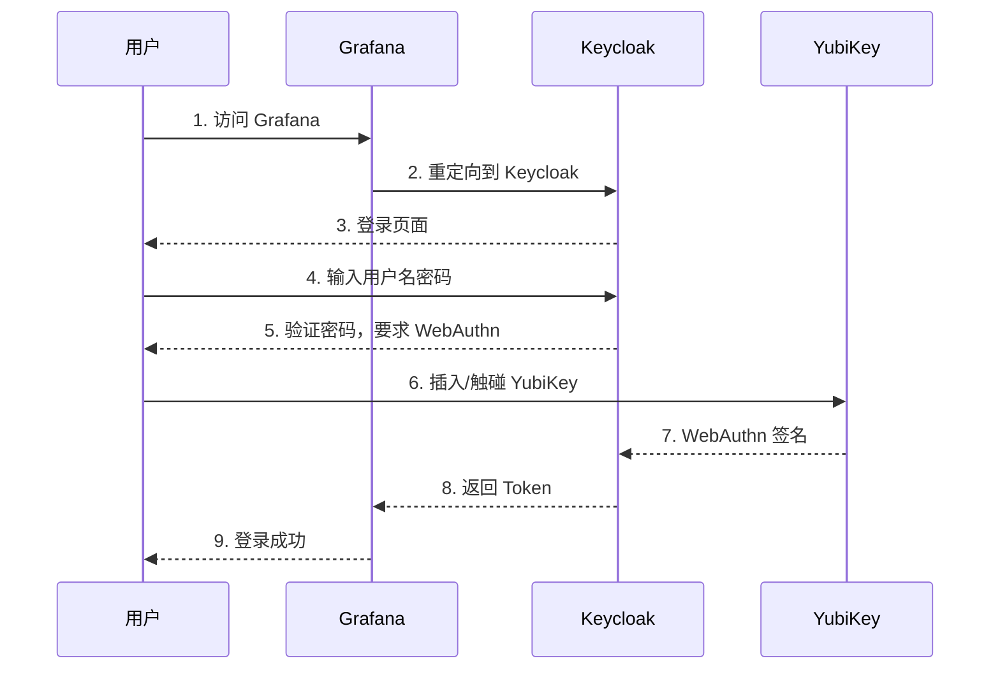
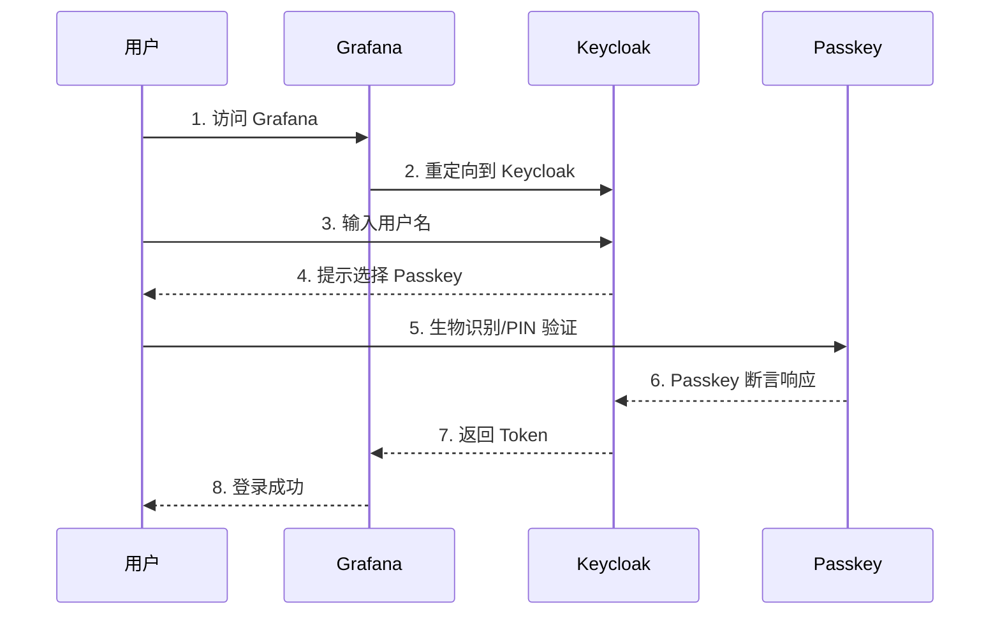
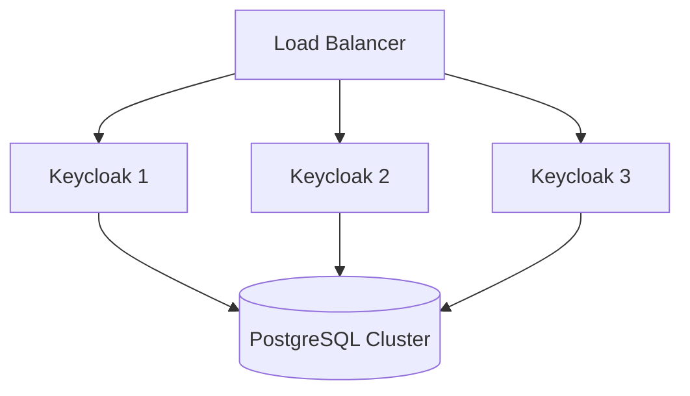

# 架构概述

## 系统架构

## 认证流程

### WebAuthn 2FA 流程

### Passwordless 流程

## 组件说明

### Keycloak

- **功能**: 身份和访问管理 (IAM)
- **协议**: OAuth 2.0, OIDC, SAML, LDAP
- **特性**: WebAuthn, Passkey, 2FA, SSO
- **端口**: 8443 (HTTPS)

### Grafana

- **功能**: 监控数据可视化
- **认证**: OIDC (通过 Keycloak)
- **特性**: Dashboard, Alerting, Team Sync
- **端口**: 3000

### PostgreSQL

- **功能**: Keycloak 数据持久化
- **数据**: 用户、角色、会话、凭证

### 反向代理 (Nginx/Traefik)

- **功能**: SSL 终止、负载均衡、路由
- **SSL**: Let's Encrypt 或自签名证书

## 安全考虑

### 传输安全

- 所有通信使用 HTTPS
- TLS 1.2+
- HSTS 启用

### 认证安全

- WebAuthn 防钓鱼
- 公钥加密
- 无共享密钥

### 会话安全

- JWT Token
- 刷新令牌
- 会话超时

## 扩展性

### 水平扩展

### 高可用

- Keycloak 多实例
- PostgreSQL 主从复制
- 共享缓存 (Infinispan)

## 下一步

- [前置要求](./prerequisites) - 准备部署环境
- [Keycloak 配置](./keycloak) - 配置身份提供商
- [部署指南](../deploy/docker-compose) - Docker 部署
