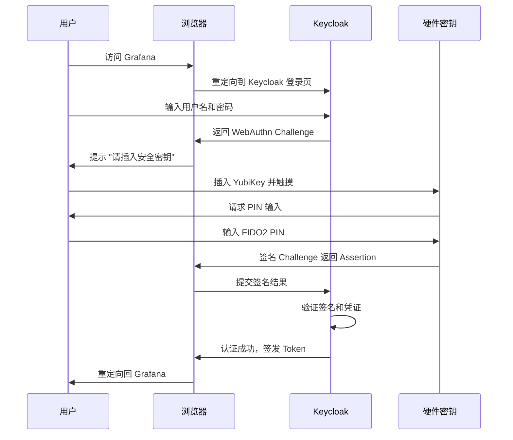
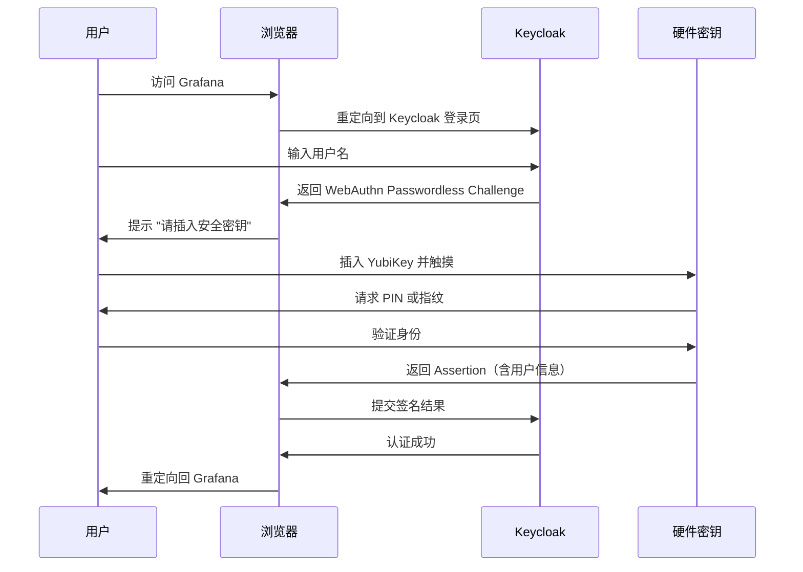

# FIDO2 硬件密钥

本章节介绍如何使用 FIDO2 硬件安全密钥（如 YubiKey）进行身份认证，以及与软件 Passkey 的区别和选型建议。

## FIDO2、WebAuthn 与 Passkey 的关系

```
FIDO2 标准
├── WebAuthn（浏览器/服务端 API）
└── CTAP2（客户端到认证器协议）
     ├── 硬件密钥（YubiKey 等） ← 本章重点
     └── 平台认证器（Windows Hello, Touch ID）

Passkey = WebAuthn discoverable credential（可跨设备同步）
硬件密钥 = 绑定物理设备的 FIDO2 凭证（不可复制）
```

| 特性 | 软件 Passkey | FIDO2 硬件密钥 |
|------|-------------|---------------|
| 存储位置 | 云端同步（iCloud/Google） | 物理设备安全芯片 |
| 可复制性 | 可跨设备同步 | 不可导出，不可复制 |
| 防钓鱼 | 是 | 是 |
| 抗中间人 | 是 | 是 |
| 设备丢失风险 | 低（有云备份） | 高（需备用密钥） |
| 合规性 | 一般 | 满足高安全合规要求（NIST AAL3） |
| 适用场景 | 日常使用、消费者 | 企业、高安全环境、管理员账号 |

## 硬件密钥选型

### 推荐型号

| 型号 | 接口 | FIDO2 | 驻留密钥数 | 生物识别 | 参考价格 |
|------|------|-------|-----------|---------|---------|
| **YubiKey 5 NFC** | USB-A + NFC | ✅ | 25 | ❌ | ~$50 |
| **YubiKey 5C NFC** | USB-C + NFC | ✅ | 25 | ❌ | ~$55 |
| **YubiKey 5 Nano** | USB-A（超小） | ✅ | 25 | ❌ | ~$50 |
| **YubiKey 5C Nano** | USB-C（超小） | ✅ | 25 | ❌ | ~$55 |
| **YubiKey 5Ci** | USB-C + Lightning | ✅ | 25 | ❌ | ~$75 |
| **YubiKey Bio** | USB-A/C | ✅ | 25 | ✅ 指纹 | ~$90 |
| **Feitian BioPass** | USB-A/C | ✅ | 50+ | ✅ 指纹 | ~$60 |
| **Google Titan** | USB-A/C + NFC | ✅ | ~20 | ❌ | ~$30 |
| **SoloKeys Solo 2** | USB-A/C + NFC | ✅ | ~50 | ❌ | ~$40 |

### 选型建议

- **企业管理员**: YubiKey 5C NFC（USB-C + NFC 兼容性最好）+ 一把备用
- **移动办公**: YubiKey 5Ci（同时支持 iPhone Lightning 和 USB-C）
- **长期插入**: YubiKey 5 Nano / 5C Nano（不影响笔记本便携性）
- **需要指纹**: YubiKey Bio（免输 PIN，体验更好）
- **预算有限**: Google Titan 或 SoloKeys

::: warning 注意
每位用户应至少注册 **两把硬件密钥**（主用 + 备用），防止单一密钥丢失或损坏导致无法登录。
:::

## 硬件密钥初始化

以 YubiKey 为例，首次使用前建议进行以下设置。

### 安装管理工具

```bash
# macOS
brew install ykman

# Ubuntu / Debian
sudo apt install yubikey-manager

# Windows
# 下载 YubiKey Manager：https://www.yubico.com/support/download/yubikey-manager/
```

### 设置 FIDO2 PIN

硬件密钥需要设置 PIN 码作为用户验证方式：

```bash
# 检查 YubiKey 信息
ykman info

# 设置 FIDO2 PIN（首次设置）
ykman fido access change-pin

# 修改 PIN
ykman fido access change-pin --pin OLD_PIN --new-pin NEW_PIN
```

::: tip PIN 码要求
- 最少 4 位，推荐 6-8 位
- 支持数字和字母
- 连续输错 8 次将锁定 FIDO2 功能（需 reset 重置）
:::

### 查看密钥信息

```bash
# 查看已注册的 FIDO2 凭证
ykman fido credentials list

# 查看 FIDO2 功能信息
ykman fido info
```

### 注册指纹（YubiKey Bio）

```bash
# 列出已注册的指纹
ykman bio fingerprint list

# 注册新指纹
ykman bio fingerprint add "右手食指"

# 删除指纹
ykman bio fingerprint delete <fingerprint_id>
```

## Keycloak 配置

### WebAuthn Policy（硬件密钥专用）

进入 **Authentication** → **Policies** → **WebAuthn Policy**，针对硬件密钥优化配置：

| 配置项 | 推荐值 | 说明 |
|--------|--------|------|
| **Relying Party Entity Name** | `your-company` | 显示在密钥注册提示中 |
| **Signature Algorithm** | ES256 | ECDSA P-256，所有 FIDO2 密钥都支持 |
| **Relying Party ID** | `keycloak.example.com` | 必须与域名匹配 |
| **Attestation Conveyance Preference** | **direct** | 获取密钥的硬件认证信息 |
| **Authenticator Attachment** | **cross-platform** | 仅允许外部硬件密钥 |
| **Require Resident Key** | OFF | 2FA 场景不需要驻留密钥 |
| **User Verification Requirement** | **required** | 强制要求 PIN 或指纹 |
| **Timeout** | 120000 | 2 分钟（给用户插入密钥的时间） |

::: info Authenticator Attachment 说明
- `cross-platform`：仅允许外部硬件密钥（USB/NFC），排除平台认证器
- `platform`：仅允许平台认证器（Windows Hello、Touch ID）
- `not specified`：允许所有类型（默认值）

如果只想接受硬件密钥，必须设为 `cross-platform`。
:::

### WebAuthn Passwordless Policy（无密码硬件密钥）

如果希望用硬件密钥实现无密码登录：

| 配置项 | 推荐值 | 说明 |
|--------|--------|------|
| **Enable Passkeys** | ON | 启用 discoverable credentials |
| **Authenticator Attachment** | **cross-platform** | 仅硬件密钥 |
| **Require Resident Key** | **ON** | 需要驻留密钥 |
| **User Verification Requirement** | **required** | 必须输入 PIN 或指纹 |
| **Attestation Conveyance Preference** | **direct** | 验证硬件真实性 |

::: warning 驻留密钥容量
硬件密钥的驻留密钥（discoverable credential）存储空间有限：
- YubiKey 5 系列：最多 25 个
- SoloKeys Solo 2：约 50 个
- Feitian BioPass：约 50 个

2FA 模式（Require Resident Key = OFF）不受此限制。
:::

### 配置 Authentication Flow

#### 方案一：密码 + 硬件密钥 2FA（推荐起步方案）

```
browser-fido2
├── Cookie (Alternative)
├── Kerberos (Alternative)
└── Forms (Sub-Flow, Required)
    ├── Username Password Form (Required)
    └── WebAuthn Authenticator (Required)     ← 插入硬件密钥
```

配置步骤：
1. 进入 **Authentication** → **Flows**
2. 复制 `browser` flow，命名为 `browser-fido2`
3. 在 Forms 子流程中 **Add step** → **WebAuthn Authenticator** → 设为 **Required**
4. 进入 **Bindings**，将 **Browser flow** 绑定到 `browser-fido2`

#### 方案二：仅硬件密钥无密码登录

```
browser-fido2-passwordless
├── Cookie (Alternative)
├── Username Form (Required)
└── WebAuthn Passwordless Authenticator (Required)  ← 触摸硬件密钥
```

#### 方案三：硬件密钥 + 软件 Passkey 混合（推荐生产方案）

允许用户选择使用硬件密钥或软件 Passkey：

```
browser-hybrid-fido2
├── Cookie (Alternative)
├── Passkey Conditional UI Authenticator (Alternative)
└── Forms (Sub-Flow, Required)
    ├── Username Password Form (Required)
    └── WebAuthn Authenticator (Alternative)
```

此方案下：
- 已注册 Passkey 的用户可以通过自动填充直接登录
- 其他用户输入密码后，可选择插入硬件密钥作为 2FA
- 未注册任何 WebAuthn 凭证的用户仍可用密码登录

## 认证流程详解

### 硬件密钥 2FA 登录流程



### 硬件密钥无密码登录流程



## 用户注册硬件密钥

### 管理员为用户配置

1. 进入 **Users** → 选择用户 → **Details**
2. 在 **Required user actions** 中添加 **WebAuthn Register**
3. 用户下次登录后将被引导注册硬件密钥

### 用户自助注册

1. 登录 Keycloak Account Console：
   ```
   https://keycloak.example.com:8443/realms/grafana/account
   ```
2. 进入 **Signing in** → **Security Key**
3. 点击 **Set up Security Key**
4. 插入硬件密钥
5. 输入 PIN 码（或触摸指纹传感器）
6. 为密钥命名（建议格式：`YubiKey-5C-主用` / `YubiKey-5C-备用`）

### 注册备用密钥

::: danger 重要
务必注册至少一把备用密钥！主密钥丢失后，没有备用密钥将无法登录。
:::

重复上述注册流程，插入第二把硬件密钥即可。注册完成后，用户的凭证列表应类似：

| 凭证名称 | 类型 | 注册时间 |
|----------|------|---------|
| YubiKey-5C-主用 | WebAuthn | 2026-04-01 |
| YubiKey-5C-备用 | WebAuthn | 2026-04-01 |

## 密钥生命周期管理

### 丢失密钥处理

当用户报告密钥丢失时：

1. **立即撤销**：管理员进入 **Users** → 选择用户 → **Credentials**，删除丢失密钥的凭证
2. **确认备用密钥**：确保用户仍有可用的备用密钥
3. **补注册新密钥**：添加 **WebAuthn Register** 到用户的 Required Actions，让用户用备用密钥登录后注册新密钥
4. **审计日志检查**：在 **Events** 中检查丢失密钥是否有异常使用记录

### 密钥重置

当 FIDO2 PIN 被锁定（连续错误 8 次）时：

```bash
# 重置 YubiKey 的 FIDO2 功能（会删除所有 FIDO2 凭证！）
ykman fido reset
```

::: danger 警告
`fido reset` 会删除密钥上所有已注册的 FIDO2 凭证，用户需要在所有服务中重新注册该密钥。
:::

### 定期审计

建议定期（每季度）执行以下检查：

1. 确认每位用户至少有 2 个有效的 WebAuthn 凭证
2. 检查是否有长期未使用的凭证（可能对应已丢失的密钥）
3. 核对 Keycloak 事件日志中的 WebAuthn 注册/认证记录

## Attestation 验证（高安全场景）

在高安全环境中，可以通过 Attestation 验证确保只有特定品牌/型号的硬件密钥可以注册。

### 启用 Attestation

1. 在 WebAuthn Policy 中设置 **Attestation Conveyance Preference** = `direct`
2. Keycloak 会记录每个凭证的 Attestation 信息

### 查看 Attestation 数据

注册硬件密钥后，在 **Users** → **Credentials** 中可以查看：
- **AAGUID**: 设备型号的唯一标识符
- **Attestation Statement**: 设备制造商的签名证书

常见 AAGUID 示例：

| AAGUID | 对应设备 |
|--------|---------|
| `cb69481e-8ff7-4039-93ec-0a2729a154a8` | YubiKey 5 (USB-A, NFC) |
| `ee882879-721c-4913-9775-3dfcce97072a` | YubiKey 5 (USB-C, NFC) |
| `d8522d9f-575b-4866-88a9-ba99fa02f35b` | YubiKey Bio (USB-A) |
| `adce0002-35bc-c60a-648b-0b25f1f05503` | Chrome on Mac (Touch ID) |

### 通过 AAGUID 限制设备类型

Keycloak 原生不支持 AAGUID 白名单过滤，但可以通过以下方式实现：

1. **自定义 Authenticator SPI**：编写 Keycloak SPI 插件，在注册时校验 AAGUID
2. **管理员审核**：注册后由管理员在 Credentials 页面人工审核设备类型
3. **事件监听器**：编写 Event Listener 在注册事件中校验并拒绝不合规设备

## 故障排除

### 硬件密钥无法识别

**症状**: 插入 YubiKey 后浏览器无反应

**排查步骤**:
1. 确认密钥已正确插入（YubiKey 指示灯应亮起）
2. 尝试其他 USB 口
3. 运行 `ykman info` 确认系统能识别设备
4. 检查浏览器是否弹出了权限提示（可能被窗口遮挡）
5. 在 Chrome 中访问 `chrome://settings/securityKeys` 测试密钥

### PIN 输入错误次数过多

**症状**: 提示 "PIN blocked"

**解决**:
```bash
# 查看剩余重试次数
ykman fido info

# 如已锁定，需要重置（会清除所有凭证）
ykman fido reset
```

重置后需要在所有服务中重新注册密钥。

### NFC 连接不稳定

**症状**: 手机通过 NFC 认证时经常失败

**解决**:
1. 确保手机 NFC 已开启
2. 将 YubiKey 平放贴紧手机背面（NFC 天线位置因手机而异）
3. 保持接触直到认证完成（通常 2-3 秒）
4. 移除手机保护壳后重试

### 注册时提示 "Not allowed"

**症状**: 注册硬件密钥时浏览器提示 "The operation either timed out or was not allowed"

**排查**:
1. 确认使用 HTTPS（WebAuthn 不支持 HTTP）
2. 检查 Relying Party ID 是否与当前域名匹配
3. 如果设置了 `Authenticator Attachment = cross-platform`，确认使用的是外部硬件密钥而非平台认证器
4. 增大 Timeout 值（默认 60 秒可能不够）

### 已注册的密钥无法认证

**症状**: 密钥已注册但登录时提示凭证无效

**排查**:
1. 确认用户使用的是注册时的同一把密钥
2. 检查 Keycloak 的 Relying Party ID 是否发生过变更（域名变化会导致已有凭证失效）
3. 在 **Users** → **Credentials** 中确认凭证仍然存在
4. 检查 WebAuthn Policy 的签名算法是否与注册时一致

## 下一步

- [WebAuthn 设置](./webauthn) - WebAuthn 基础配置
- [Passkey 配置](./passkey) - 软件 Passkey 配置
- [安全加固](./security) - 整体安全加固方案
